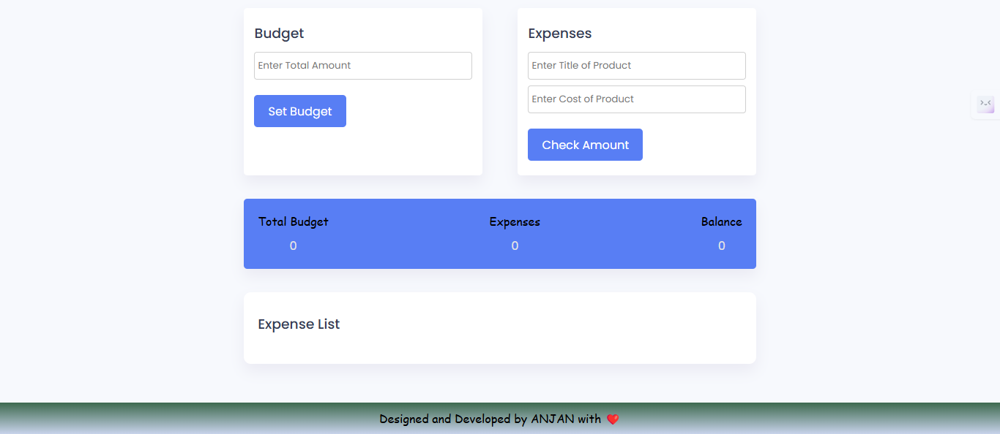

# Simple Budget App

 <!-- Replace with your screenshot path -->

## Table of Contents
- [Simple Budget App](#simple-budget-app)
  - [Table of Contents](#table-of-contents)
  - [Introduction](#introduction)
  - [Features](#features)
  - [Technologies Used](#technologies-used)
  - [Installation](#installation)

## Introduction

The Simple Budget App is a web-based application that helps users track their income and expenses. It provides an intuitive interface for managing budgets, allowing users to input their financial data and visualize their spending habits.

## Features

- **Add Income and Expenses**: Easily input your income and expenses.
- **View Balance**: See your current balance based on your income and expenses.
- **Responsive Design**: Works well on both desktop and mobile devices.
- **User -Friendly Interface**: Simple and clean layout for ease of use.

## Technologies Used

- **HTML**: For structuring the content.
- **CSS**: For styling the application.
- **JavaScript**: For functionality and interactivity.
